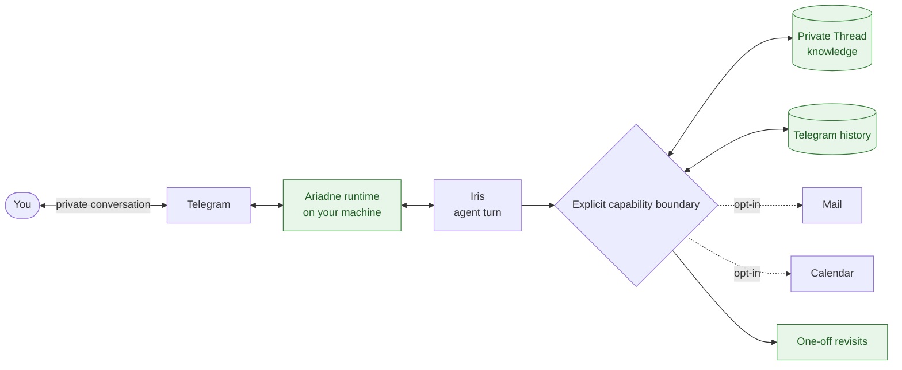

<div align="center">

# Ariadne

> *"The hope is that, in not too many years, human brains and computing machines will be coupled very tightly."*
> — [J. C. R. Licklider, 1960](https://groups.csail.mit.edu/medg/people/psz/Licklider.html)

[](https://github.com/TGDivy/ariadne/actions/workflows/ci.yml)
[](https://www.python.org/)

**A private, local-first companion system that connects a capable agent to one person through Telegram.**

[How it works](#how-it-works) · [Quick start](#quick-start) · [Documentation](#documentation) · [Design boundaries](docs/architecture.md)

</div>

## A companion with continuity

Most assistants start from zero every time. Ariadne is built around a different idea: a companion should be able to carry useful context forward, notice a meaningful loose end, and help close a small loop without taking ownership away from the person it serves.

It runs on the owner's machine and connects through a private Telegram conversation. Personal knowledge remains in a separate, owner-controlled *Thread* repository; Ariadne gives the agent a small, explicit set of capabilities for working with it.

## How it works



The dotted paths are optional integrations. Ariadne is deliberately not a hosted SaaS product or a shared control plane: its job is to make one private relationship useful, inspectable, and bounded.

## What is here today

| Surface | What it enables |
| --- | --- |
| **Private conversation** | Rich Telegram messages, reply context, attachment handling, questions, reactions, and conversation continuity. |
| **Durable context** | Searchable personal knowledge with explicit records, relationships, and Git-backed change history. |
| **Follow-through** | One-off scheduled revisits that can re-check a concrete open loop at an appropriate level of attention. |
| **Optional life integrations** | iCloud Mail routing and Calendar operations, each separately configured and scoped. |
| **Evaluation and observability** | Reproducible companion-behaviour scenarios plus optional OpenTelemetry/Grafana telemetry. |

## Design boundaries

The useful part is not simply that an agent can act; it is that its authority stays legible.

- **Private by default.** Ariadne runs locally; secrets and owner data live in private configuration and owner-controlled stores, not this repository.
- **Small, named operations.** The agent works through capabilities such as searching knowledge, creating a calendar event, or scheduling a revisit—not through an implicit “do anything” permission.
- **Evidence is not authority.** Mail, calendar content, attachments, and web pages can inform a decision but cannot authorize unrelated actions.
- **Human review where it matters.** File delivery is approval-gated, and mail turns can draft but never send email.
- **Continuity without theatre.** The system is designed to complete a useful loop when it can and stay quiet when it cannot add value.

Read the fuller [architecture and boundary notes](docs/architecture.md) for the turn lifecycle, data ownership, and integration contracts.

## Quick start

You need [uv](https://docs.astral.sh/uv/), a locally authenticated Codex installation, a Telegram bot token, and a private Git-backed Thread repository.

```bash
git clone https://github.com/TGDivy/ariadne.git
cd ariadne
uv sync --locked

mkdir -p ~/.config/ariadne
cp config.example.toml ~/.config/ariadne/config.toml
chmod 600 ~/.config/ariadne/config.toml
# Edit the private config: bot token, allowed Telegram user, and Thread path.

uv run python -m ariadne config check
uv run python -m ariadne
```

The example configuration starts with Mail, Calendar, and telemetry disabled. See the [getting-started guide](docs/getting-started.md) before enabling anything optional.

## Documentation

| Guide | For |
| --- | --- |
| [Getting started](docs/getting-started.md) | Prerequisites, private configuration, and a safe first run. |
| [Architecture and boundaries](docs/architecture.md) | How turns, data, capabilities, and integration authority fit together. |
| [Operations reference](docs/operations.md) | Optional Mail, Calendar, revisits, telemetry, and maintenance commands. |
| [Telegram live chat](docs/telegram-live-chat.md) | Rich-message behaviour, state, delivery, and manual testing. |
| [Knowledge capability](docs/knowledge-capability.md) | The durable knowledge model and its capability contract. |
| [Behaviour scenarios](docs/behaviour-scenarios.md) | Replayable, isolated judgement checks for companion behaviour. |
| [Companion direction](docs/companion-direction.md) | Product intent and principles. |

## Development

```bash
uv sync --locked --all-groups
uv run ruff format --check .
uv run ruff check .
uv run mypy src
uv run pytest
```

This repository is a living personal system, not a claim that private life can be reduced to an optimisation problem. The code is public so its boundaries can be read, questioned, and improved.
