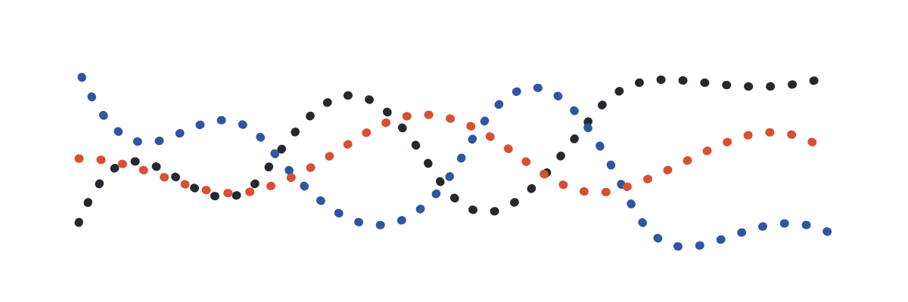

<div align="center">

# Ariadne

> *"The hope is that, in not too many years, human brains and computing machines will be coupled very tightly."*
> — [J. C. R. Licklider, 1960](https://groups.csail.mit.edu/medg/people/psz/Licklider.html)

[](https://github.com/TGDivy/ariadne/actions/workflows/ci.yml)
[](https://www.python.org/)

**A private, local-first companion system that connects a capable agent to one person through Telegram.**

[How it works](#how-it-works) · [Quick start](#quick-start) · [Guides](#guides)

<picture>
  <source media="(prefers-color-scheme: dark)" srcset="docs/assets/ariadne-thread-dark.svg">
  
</picture>

</div>

## A companion with continuity

Most assistants start from zero every time. Ariadne is built around a different idea: a companion should be able to carry useful context forward, notice a meaningful loose end, and help close a small loop without taking ownership away from the person it serves.

It runs on the owner's machine and connects through a private Telegram conversation. Personal knowledge remains in a separate, owner-controlled *Thread* repository; Ariadne gives the agent a small, explicit set of capabilities for working with it.

## How it works

You talk to Iris in a private Telegram conversation. Ariadne runs on your machine; the agent uses first-class capabilities for conversational actions and a compact, discoverable CLI for broader personal-data queries such as Mail and Calendar. Your *Thread* remains a separate, owner-controlled Git repository.

## What is here today

| Surface | What it enables |
| --- | --- |
| **Private conversation** | Rich Telegram messages, reply context, attachment handling, questions, reactions, and conversation continuity. |
| **Durable context** | Searchable, linked personal records with Git-backed change history. |
| **Follow-through** | One-off scheduled revisits that can re-check a concrete open loop at an appropriate level of attention. |
| **Optional life integrations** | iCloud Mail routing and Calendar operations, each separately configured and scoped. |
| **Evaluation and observability** | Reproducible companion-behaviour scenarios plus optional OpenTelemetry/Grafana telemetry. |

Read the fuller [architecture and boundary notes](docs/architecture.md) for the turn lifecycle, data ownership, and integration contracts.

## Quick start

You need [uv](https://docs.astral.sh/uv/), a locally authenticated Codex installation, a Telegram bot token, and a private Git-backed Thread repository.

```bash
git clone https://github.com/TGDivy/ariadne.git
cd ariadne
uv sync --locked

mkdir -p ~/.config/ariadne
cp config.example.toml ~/.config/ariadne/config.toml
chmod 600 ~/.config/ariadne/config.toml
# Edit the private config: bot token, allowed Telegram user, and Thread path.

uv run ariadne config check
uv run ariadne serve
```

The example configuration starts with Mail, Calendar, and telemetry disabled. See the [getting-started guide](docs/getting-started.md) before enabling anything optional.

## Guides

Start with the guide that matches what you need:

- [Getting started](docs/getting-started.md) — prerequisites, private configuration, and a safe first run.
- [Architecture and boundaries](docs/architecture.md) — turns, data ownership, capabilities, and integration authority.
- [Operations reference](docs/operations.md) — optional Mail, Calendar, revisits, telemetry, and maintenance commands.

<details>
<summary>Reference guides</summary>

- [Telegram live chat](docs/telegram-live-chat.md) — rich-message behaviour, state, delivery, and manual testing.
- [Knowledge capability](docs/knowledge-capability.md) — the durable knowledge model and its capability contract.
- [Behaviour scenarios](docs/behaviour-scenarios.md) — replayable, isolated judgement checks for companion behaviour.
- [Companion direction](docs/companion-direction.md) — product intent and principles.

</details>

## Development

```bash
uv sync --locked --all-groups
uv run ruff format --check .
uv run ruff check .
uv run mypy src
uv run pytest
```
