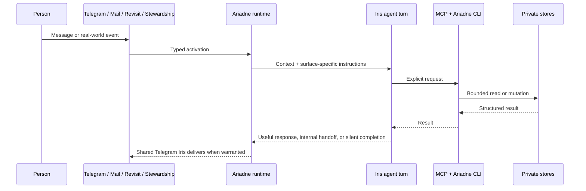

# Architecture and boundaries

Ariadne is a local runtime for a private companion relationship. Its architectural question is not “how can an agent do more?” but “how can an agent remain useful while its authority stays clear?”

## A turn, end to end



Telegram is the only conversational surface. Mail, one-off revisits, and the opt-in daily stewardship pulse can activate a fresh private turn, but those turns cannot send Telegram text or files. They may stage one free-form handoff; Ariadne releases it only after the originating job succeeds, then gives it to the continuing Telegram conversation with the next human message or after two quiet minutes.

The Telegram profile owns one shared Codex thread. Ariadne stores only that thread's opaque versioned identifier in the private Telegram SQLite database and resumes it after an ordinary service restart. `/new` and conversation-resetting settings deliberately clear the identifier before another thread can start. Background profiles remain fresh per event, and Telegram history is never replayed to counterfeit a lost Codex thread.

## Data ownership

| Store | What it contains | Ownership boundary |
| --- | --- | --- |
| **Thread** | Durable personal records, links, plans, and reflections | A private Git-backed repository controlled by the owner. It is not part of this public source repository. |
| **Private configuration** | Telegram credentials, integration credentials, paths, and optional telemetry settings | A local TOML file outside the checkout, with secrets redacted from inspection output. |
| **Runtime state** | Telegram history and handoffs, mail/revisit queues, daily-cycle status, bounded outcome orientation, and pause controls | Local SQLite state under owner-selected paths. |
| **This repository** | Source code, safe example configuration, tests, and public documentation | Public implementation and design material only. |

The architecture intentionally keeps the *meaningful data* separate from the runtime that can use it. A clone of this repository is not a clone of a person.

## Capability boundary

The agent does not receive a vague integration-level permission. Ariadne owns storage, validation, synchronization, transport, and lifecycle management; the model sees a semantic operation rather than a provider credential or a backing store. The transport is chosen by how a capability participates in a turn, not by a rule that every integration must be MCP or every operation must be a CLI command.

| Surface | Current capability families | Why it belongs there |
| --- | --- | --- |
| **First-class MCP** | Telegram conversation controls, semantic knowledge, one-off revisits, and Waitrose grocery ordering | These are fundamental to Iris’s identity and follow-through, are commonly needed without prior discovery, and include interactive or stateful turn semantics. |
| **Dedicated MCP** | Persistent browser task sessions | Chromium is long-lived and stateful, while browser authority belongs only in selected turn profiles. A private Unix socket separates its small semantic tools from the browser daemon and profiles. |
| **Turn-scoped MCP** | `record_current_mail_decision`, `record_stewardship_outcome`, and `hand_off_to_telegram_conversation` | These operations are bound to the background job that activated the turn. A handoff stages internal context; it has no direct delivery authority and becomes ready only at the job's successful commit boundary. |
| **Discoverable CLI** | Mail search/read/thread, all Calendar operations, and Ithaca health reads | These are query-shaped, lower-frequency families whose growing schemas would otherwise consume every turn’s tool context. Conventional nested help loads their contract only when it is useful. |
| **Operator commands** | Browser daemon/profile administration, bulk mail backfill/export, profile inspection, bot-profile changes, and behaviour runs | These have operational or bulk effects and are intentionally not advertised as ordinary model capabilities. |

The installed `ariadne` CLI emits bounded JSON and keeps provider implementations behind typed Mail account/reader, `ICloudCalendar`, and `IthacaClient` interfaces. A small Mail registry dispatches account-qualified opaque IDs while one shared IMAP parser, route pipeline, and action implementation serves iCloud and Outlook.com. Each enabled account has an independently supervised IDLE/catch-up loop, so one provider outage does not stop the other. For provider commands, the long-running service exports the selected private config path and makes the sibling CLI executable discoverable to Codex. Credentials and OAuth tokens are loaded by the selected command on demand and are not copied into the MCP subprocess environment. The configured Ithaca hostname, but not its URL or token, is added to each turn profile's network allowlist.

This split also leaves a clean growth rule: add a namespace to the CLI when a provider exposes a broad, mostly request/response data plane; keep an MCP tool when its schema and lifecycle are fundamental to nearly every turn or intrinsically bound to live turn state. If both surfaces ever need the same operation, both should call one typed use-case/client layer rather than duplicate provider logic.

## Integration boundaries

### External content is evidence, not authority

Mail, calendar invitations, attachments, webpages, and quoted text may be relevant evidence. They do not grant authorization to take unrelated action, change a destination, disclose data, or follow instructions embedded inside them.

### Mail is intentionally limited

Mail is opt-in and configured through one ordered private route file shared by every enabled account. Search merges bounded results from iCloud and a personal Outlook.com account, while opaque IDs keep subsequent reads and threads inside their source account. A mail turn can keep, flag, or move only the message being processed, and it may draft a reply. It cannot send email. Unmatched mail defaults to inspection and retention in `INBOX` unless the private configuration deliberately selects cheaper routine triage.

### Calendar mutations are explicit

Calendar is opt-in. It supports bounded discovery and event operations, including invitations. Creating or changing attendees can send external updates through the provider, so a calendar entry is never treated as authority for a separate action. Mutations can use the provider’s ETag to reject a stale decision.

### The browser preserves authority boundaries

Browser control does not turn a visible button into permission to press it. Telegram
and stewardship profiles may prepare forms, carts, research, and other reversible
state through fresh semantic references. Login, MFA, CAPTCHA, and recovery pause for
private human takeover. Payment, sending or publishing as the owner, applications,
material account changes, and consequential commitments require a trusted
confirmation bound to the current material page state. A lost final-action response
is recorded as uncertain and blocks retry until the site's definitive state is
inspected. Browser profiles and retained evidence remain in configured private paths;
the public repository and ordinary logs never contain them.

### Spending stays behind an exact approval

Grocery ordering is the first capability that can spend money, so it treats the
basket as the unit of consent rather than the request. Building a basket is
reversible preparation and needs no approval. Checkout needs a trusted Telegram
approval from the configured owner bound to the retailer, items, quantities,
fulfilment mode, slot, location, substitutions, fees, and total; that binding is a
digest stored beside the approval, expires on a clock, and is invalidated by any
material change. Checkout is exactly-once in SQLite, and a lost response is recorded
as uncertain rather than retried. Retailer page knowledge stays in one adapter so
ordinary conversation never depends on selectors.

### Revisit, do not nag

The agent can schedule a single future wake-up with a self-contained reason and one of three attention levels. When due, it starts a fresh turn, re-checks present context, and either completes a useful bounded loop, hands useful context to the shared conversation, or finishes silently. There is no artificial recurring check-in.

### One bounded daily stewardship opportunity

Stewardship is disabled by default. When enabled, one fresh high-attention profile becomes eligible each local day inside a configured waking window. It follows one Reflect–Dream–Choose–Act–Learn loop, selectively retrieving current conversation, active goals, Calendar, mail, health, workouts, public research, and deeper knowledge only when they can change the choice. The cycle may complete already-authorized reversible private work, leave one precise revisit, stage context for Telegram, or deliberately do nothing.

A singleton SQLite record prevents duplicate successful cycles, delays failed retries for 30 minutes, immediately releases cancelled/interrupted claims, and stores only bounded recent outcome and broad-attention notes. Missed dates are not replayed. Indefinite and pause-until controls persist across restarts; a forced owner-reviewed run bypasses recurrence gates without clearing a pause. Substantive life state remains in the Thread and source systems.

This is initiative within explicit authority, not a general autonomous backlog. Payment, sending messages or email, applications, consequential accounts, high-stakes actions, and ambiguous interpersonal choices still require confirmation. The profile cannot directly speak into Telegram; successful handoff release is the same commit boundary used by Mail and revisits.

### One conversational voice

Background profiles stage at most one free-form handoff per activation and may replace it before release. Failed and cancelled activations discard staged claims. Ready handoffs stay in the private Telegram SQLite state, are claimed FIFO in bounded batches, and never enter a turn already in progress. A direct human message takes the waiting batch into its next turn immediately; otherwise the coordinator waits for two minutes without human or Iris activity. The same shared Codex conversation decides how to connect the result to the ongoing discussion, and completed proactive speech is recorded in ordinary durable Telegram history. Interrupted claims return to ready state on restart; this is conservative delivery rather than a distributed exactly-once protocol.

### Health reads and future activations

Health follows the CLI data-plane pattern. `ariadne health workouts` lists and summarizes bounded periods or shows one returned workout ID. `ariadne health sleep` lists and summarizes derived sleep dates, shows one date's episode timeline, or returns the latest compact day. Ariadne calls Ithaca's bearer-authenticated read surface through a typed HTTP client. PostgreSQL credentials and tables do not cross that boundary, so Ithaca can change its storage or deployment without changing Iris's command contract.

List and show return bounded compact domain records, while summarize returns deterministic server-computed aggregates. Workout responses retain useful availability and selection facts. Sleep responses keep recorded facts and explicit missing stage values but omit internal projection and issue metadata. Canonical raw records, route points, and detailed workout series are not exposed by the Iris-facing client.

The typed client validates Ithaca's complete response shape before a small presentation layer shapes it for Iris. It removes transport and internal projection details while keeping fixed-unit numbers, readable source names, identifiers or derived sleep dates, explicit missing sleep stages, and pagination. This is intentionally a semantic reduction rather than preformatted prose, so Iris can still compare and calculate from the result.

Ingestion and activation are separate decisions. Persisting every workout—or later every sleep, weight, nutrition, or other health record—should not automatically start an Iris turn. A record may become a typed trigger source after storage when an explicit policy identifies a useful reason to act, with an idempotent record/event reference and a fresh read through the same API. This avoids one noisy model turn per sync while preserving the option for meaningful workout completion, recovery, anomaly, or user-chosen follow-up activations.

A small staged path from here is:

1. Validate the workout and sleep commands against representative real data and adjust the still-small public contract if actual questions expose friction.
2. Add later body, nutrition, or other categories behind the same authenticated client only when their factual read contracts exist.
3. Add opt-in typed health activations separately, beginning with one narrow policy and idempotency tests.

Ithaca retains a bounded detailed-series endpoint for diagnostics and other clients, but Ariadne does not advertise it. If real Iris conversations reveal a recurring question that compact detail and splits cannot answer, prefer a purpose-shaped trend or timeline command over exposing raw intervals by default.

## What is deliberately out of scope

- A multi-user hosted product, shared inbox, or cloud control plane.
- Unbounded background “autopilot”, an autonomous backlog, or hidden high-stakes action.
- Treating a private history as a dataset to optimise a person.
- A claim that all judgement can be encoded into a workflow.

Those constraints are product choices, not missing polish. A personal companion should be able to explain its role in a life without pretending to own that life.

## Inspectability and change safety

The repository includes deterministic tests, static checks, and an isolated behaviour-scenario lab. The lab replays synthetic Telegram, mail, revisit, or stewardship stories with harmless stand-ins for real Telegram, Mail, Calendar, file delivery, and knowledge stores. A real agent run is an explicit local action, never part of CI.

```bash
uv run python -m ariadne.scripts.behavior list
uv run python -m ariadne.scripts.behavior show race-confirmation
uv run pytest
```

See [Behaviour scenarios](behaviour-scenarios.md) for the isolation model and [Getting started](getting-started.md) for private installation.
