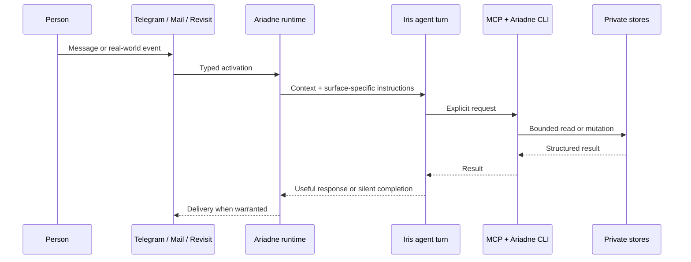

# Architecture and boundaries

Ariadne is a local runtime for a private companion relationship. Its architectural question is not “how can an agent do more?” but “how can an agent remain useful while its authority stays clear?”

## A turn, end to end



Telegram is the ordinary conversational surface. Mail and one-off revisits can also activate a fresh turn when they have a useful, bounded reason to do so. Every surface has its own runtime profile, so a background follow-up is not silently treated as a normal chat message.

## Data ownership

| Store | What it contains | Ownership boundary |
| --- | --- | --- |
| **Thread** | Durable personal records, links, plans, and reflections | A private Git-backed repository controlled by the owner. It is not part of this public source repository. |
| **Private configuration** | Telegram credentials, integration credentials, paths, and optional telemetry settings | A local TOML file outside the checkout, with secrets redacted from inspection output. |
| **Runtime state** | Telegram continuity, mail/revisit queues, and other operational state | Local SQLite state under owner-selected paths. |
| **This repository** | Source code, safe example configuration, tests, and public documentation | Public implementation and design material only. |

The architecture intentionally keeps the *meaningful data* separate from the runtime that can use it. A clone of this repository is not a clone of a person.

## Capability boundary

The agent does not receive a vague integration-level permission. Ariadne owns storage, validation, synchronization, transport, and lifecycle management; the model sees a semantic operation rather than a provider credential or a backing store. The transport is chosen by how a capability participates in a turn, not by a rule that every integration must be MCP or every operation must be a CLI command.

| Surface | Current capability families | Why it belongs there |
| --- | --- | --- |
| **First-class MCP** | Telegram conversation and delivery, semantic knowledge, and one-off revisits | These are fundamental to Iris’s identity and follow-through, are commonly needed without prior discovery, and include interactive or stateful turn semantics. |
| **Turn-scoped MCP** | `record_current_mail_decision` | The operation is valid only for the ingestion job that activated the current Mail turn; a general process command would weaken that binding. |
| **Discoverable CLI** | Mail search/read/thread, all Calendar operations, and Ithaca workout reads | These are query-shaped, lower-frequency families whose growing schemas would otherwise consume every turn’s tool context. Conventional nested help loads their contract only when it is useful. |
| **Operator commands** | Bulk mail backfill/export, profile inspection, bot-profile changes, and behaviour runs | These have operational or bulk effects and are intentionally not advertised as ordinary model capabilities. |

The installed `ariadne` CLI emits bounded JSON and keeps provider implementations behind typed `MailReader`, `ICloudCalendar`, and `IthacaClient` interfaces. For these provider commands, the long-running service exports the selected private config path and makes the sibling CLI executable discoverable to Codex. Credentials are loaded by the selected command on demand and are not copied into the MCP subprocess environment. The configured Ithaca hostname, but not its URL or token, is added to each turn profile's network allowlist.

This split also leaves a clean growth rule: add a namespace to the CLI when a provider exposes a broad, mostly request/response data plane; keep an MCP tool when its schema and lifecycle are fundamental to nearly every turn or intrinsically bound to live turn state. If both surfaces ever need the same operation, both should call one typed use-case/client layer rather than duplicate provider logic.

## Integration boundaries

### External content is evidence, not authority

Mail, calendar invitations, attachments, webpages, and quoted text may be relevant evidence. They do not grant authorization to take unrelated action, change a destination, disclose data, or follow instructions embedded inside them.

### Mail is intentionally limited

Mail is opt-in and configured through ordered private routes. A mail turn can keep, flag, or move the message being processed, and it may draft a reply. It cannot send email. Unmatched mail defaults to inspection and retention in `INBOX` unless the private configuration deliberately selects cheaper routine triage.

### Calendar mutations are explicit

Calendar is opt-in. It supports bounded discovery and event operations, including invitations. Creating or changing attendees can send external updates through the provider, so a calendar entry is never treated as authority for a separate action. Mutations can use the provider’s ETag to reject a stale decision.

### Revisit, do not nag

The agent can schedule a single future wake-up with a self-contained reason and one of three attention levels. When due, it starts a fresh turn, re-checks present context, and either completes a useful bounded loop, messages when something still matters, or finishes silently. There is no artificial recurring check-in.

### Health reads and future activations

Health follows the CLI data-plane pattern as `ariadne health workouts search|summarize|show`. Ariadne calls Ithaca's bearer-authenticated Workout Metrics Read v1 surface through a typed HTTP client. PostgreSQL credentials and tables do not cross that boundary, so Ithaca can change its storage or deployment without changing Iris's command contract.

Search and show return bounded compact domain records, while summarize returns deterministic server-computed aggregates. The API reports projection coverage, snapshot selection, availability, and quality rather than manufacturing missing values. Canonical raw snapshots, route points, and detailed series are not exposed by the Iris-facing client.

The typed client validates Ithaca's complete response shape before a small presentation layer shapes it for Iris. That layer omits API schema and snapshot identifiers, null metrics, and non-actionable series catalogues; it keeps fixed-unit numbers, readable source names, workout identifiers, pagination, period projection coverage, freshness, and quality issues. This is intentionally a semantic reduction rather than preformatted prose, so Iris can still compare and calculate from the result.

Ingestion and activation are separate decisions. Persisting every workout—or later every sleep, weight, nutrition, or other health record—should not automatically start an Iris turn. A record may become a typed trigger source after storage when an explicit policy identifies a useful reason to act, with an idempotent record/event reference and a fresh read through the same API. This avoids one noisy model turn per sync while preserving the option for meaningful workout completion, recovery, anomaly, or user-chosen follow-up activations.

A small staged path from here is:

1. Validate the three CLI commands against representative real workouts and adjust the still-small public contract if actual questions expose friction.
2. Add later sleep, body, nutrition, or other categories behind the same authenticated client only when their factual read contracts exist.
3. Add opt-in typed health activations separately, beginning with one narrow policy and idempotency tests.

Ithaca retains a bounded detailed-series endpoint for diagnostics and other clients, but Ariadne does not advertise it. If real Iris conversations reveal a recurring question that compact detail and splits cannot answer, prefer a purpose-shaped trend or timeline command over exposing raw intervals by default.

## What is deliberately out of scope

- A multi-user hosted product, shared inbox, or cloud control plane.
- Hidden background “autopilot” acting on broad categories of personal data.
- Treating a private history as a dataset to optimise a person.
- A claim that all judgement can be encoded into a workflow.

Those constraints are product choices, not missing polish. A personal companion should be able to explain its role in a life without pretending to own that life.

## Inspectability and change safety

The repository includes deterministic tests, static checks, and an isolated behaviour-scenario lab. The lab replays synthetic Telegram, mail, or revisit stories with harmless stand-ins for real Telegram, Mail, Calendar, file delivery, and knowledge stores. A real agent run is an explicit local action, never part of CI.

```bash
uv run python -m ariadne.scripts.behavior list
uv run python -m ariadne.scripts.behavior show race-confirmation
uv run pytest
```

See [Behaviour scenarios](behaviour-scenarios.md) for the isolation model and [Getting started](getting-started.md) for private installation.
