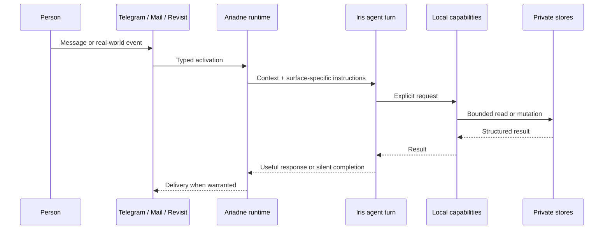

# Architecture and boundaries

Ariadne is a local runtime for a private companion relationship. Its architectural question is not “how can an agent do more?” but “how can an agent remain useful while its authority stays clear?”

## A turn, end to end



Telegram is the ordinary conversational surface. Mail and one-off revisits can also activate a fresh turn when they have a useful, bounded reason to do so. Every surface has its own runtime profile, so a background follow-up is not silently treated as a normal chat message.

## Data ownership

| Store | What it contains | Ownership boundary |
| --- | --- | --- |
| **Thread** | Durable personal records, relationships, plans, and reflections | A private Git-backed repository controlled by the owner. It is not part of this public source repository. |
| **Private configuration** | Telegram credentials, integration credentials, paths, and optional telemetry settings | A local TOML file outside the checkout, with secrets redacted from inspection output. |
| **Runtime state** | Telegram continuity, mail/revisit queues, and other operational state | Local SQLite state under owner-selected paths. |
| **This repository** | Source code, safe example configuration, tests, and public documentation | Public implementation and design material only. |

The architecture intentionally keeps the *meaningful data* separate from the runtime that can use it. A clone of this repository is not a clone of a person.

## Capability boundary

The agent does not receive a vague integration-level permission. Ariadne exposes clearly named operations with defined parameters and results, for example:

- retrieve, create, update, and archive semantic knowledge records;
- read recent Telegram context, ask a question, or request an approval-gated file delivery;
- inspect a configured mailbox and record the decision for the current message;
- search a calendar, check availability, or make a deliberately scoped event mutation;
- schedule, inspect, update, or cancel a one-off revisit.

The implementation owns storage, validation, synchronization, transport, and lifecycle management. The model sees the semantic operation it can use, rather than a provider credential or a hidden side channel.

## Integration boundaries

### External content is evidence, not authority

Mail, calendar invitations, attachments, webpages, and quoted text may be relevant evidence. They do not grant authorization to take unrelated action, change a destination, disclose data, or follow instructions embedded inside them.

### Mail is intentionally limited

Mail is opt-in and configured through ordered private routes. A mail turn can keep, flag, or move the message being processed, and it may draft a reply. It cannot send email. Unmatched mail defaults to inspection and retention in `INBOX` unless the private configuration deliberately selects cheaper routine triage.

### Calendar mutations are explicit

Calendar is opt-in. It supports bounded discovery and event operations, including invitations. Creating or changing attendees can send external updates through the provider, so a calendar entry is never treated as authority for a separate action. Mutations can use the provider’s ETag to reject a stale decision.

### Revisit, do not nag

The agent can schedule a single future wake-up with a self-contained reason and one of three attention levels. When due, it starts a fresh turn, re-checks present context, and either completes a useful bounded loop, messages when something still matters, or finishes silently. There is no artificial recurring check-in.

## What is deliberately out of scope

- A multi-user hosted product, shared inbox, or cloud control plane.
- Hidden background “autopilot” acting on broad categories of personal data.
- Treating a private history as a dataset to optimise a person.
- A claim that all judgement can be encoded into a workflow.

Those constraints are product choices, not missing polish. A personal companion should be able to explain its role in a life without pretending to own that life.

## Inspectability and change safety

The repository includes deterministic tests, static checks, and an isolated behaviour-scenario lab. The lab replays synthetic Telegram, mail, or revisit stories with harmless stand-ins for real Telegram, Mail, Calendar, file delivery, and knowledge stores. A real agent run is an explicit local action, never part of CI.

```bash
uv run python -m ariadne.scripts.behavior list
uv run python -m ariadne.scripts.behavior show race-confirmation
uv run pytest
```

See [Behaviour scenarios](behaviour-scenarios.md) for the isolation model and [Getting started](getting-started.md) for private installation.
